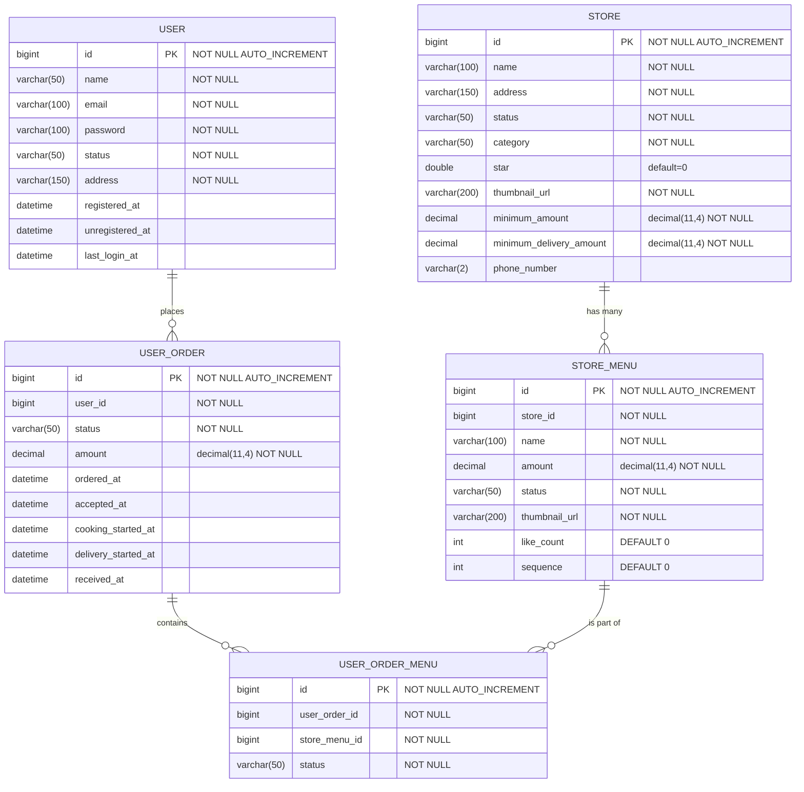

## delivery DB의 user 테이블, store 테이블, store_menu 테이블


```
CREATE TABLE `user` (
  `id` bigint NOT NULL AUTO_INCREMENT,
  `name` varchar(50) COLLATE utf8mb4_bin NOT NULL,
  `email` varchar(100) COLLATE utf8mb4_bin NOT NULL,
  `password` varchar(100) COLLATE utf8mb4_bin NOT NULL,
  `status` varchar(50) COLLATE utf8mb4_bin NOT NULL,
  `address` varchar(150) COLLATE utf8mb4_bin NOT NULL,
  `registered_at` datetime DEFAULT NULL,
  `unregistered_at` datetime DEFAULT NULL,
  `last_login_at` datetime DEFAULT NULL,
  PRIMARY KEY (`id`)
) ENGINE=InnoDB AUTO_INCREMENT=2 DEFAULT CHARSET=utf8mb4 COLLATE=utf8mb4_bin
```

```
CREATE TABLE IF NOT EXISTS `store` (
  `id` BIGINT(32) NOT NULL AUTO_INCREMENT,
  `name` VARCHAR(100) NOT NULL,
  `address` VARCHAR(150) NOT NULL,
  `status` VARCHAR(50) NOT NULL,
  `category` VARCHAR(50) NOT NULL,
  `star` DOUBLE NULL DEFAULT 0,
  `thumbnail_url` VARCHAR(200) NOT NULL,
  `minimum_amount` DECIMAL(11,4) NOT NULL,
  `minimum_delivery_amount` DECIMAL(11,4) NOT NULL,
  `phone_number` VARCHAR(20) NULL,
  PRIMARY KEY (`id`))
ENGINE = InnoDB
```

```
CREATE TABLE IF NOT EXISTS `store_menu` (
  `id` BIGINT(32) NOT NULL AUTO_INCREMENT,
  `store_id` BIGINT(32) NOT NULL,
  `name` VARCHAR(100) NOT NULL,
  `amount` DECIMAL(11,4) NOT NULL,
  `status` VARCHAR(50) NOT NULL,
  `thumbnail_url` VARCHAR(200) NOT NULL,
  `like_count` INT NULL DEFAULT 0,
  `sequence` INT NULL DEFAULT 0,
  PRIMARY KEY (`id`)
)
ENGINE = InnoDB
```

```
CREATE TABLE IF NOT EXISTS `user_order` (
  `id` BIGINT(32) NOT NULL AUTO_INCREMENT,
  `user_id` BIGINT(32) NOT NULL,
  `status` VARCHAR(50) NOT NULL,
  `amount` DECIMAL(11,4) NOT NULL,
  `ordered_at` DATETIME NULL,
  `accepted_at` DATETIME NULL,
  `cooking_started_at` DATETIME NULL,
  `delivery_started_at` DATETIME NULL,
  `received_at` DATETIME NULL,
  PRIMARY KEY (`id`),
  INDEX `idx_user_id` (`user_id` ASC) VISIBLE
  )
ENGINE = InnoDB;

CREATE TABLE IF NOT EXISTS `user_order_menu` (
  `id` BIGINT(32) NOT NULL AUTO_INCREMENT,
  `user_order_id` BIGINT(32) NOT NULL,
  `store_menu_id` BIGINT(32) NOT NULL,
  `status` VARCHAR(50) NOT NULL,
  PRIMARY KEY (`id`),
  INDEX `idx_user_order_id` (`user_order_id` ASC) VISIBLE,
  INDEX `idx_store_menu_id` (`store_menu_id` ASC) VISIBLE
  )
ENGINE = InnoDB;
```
